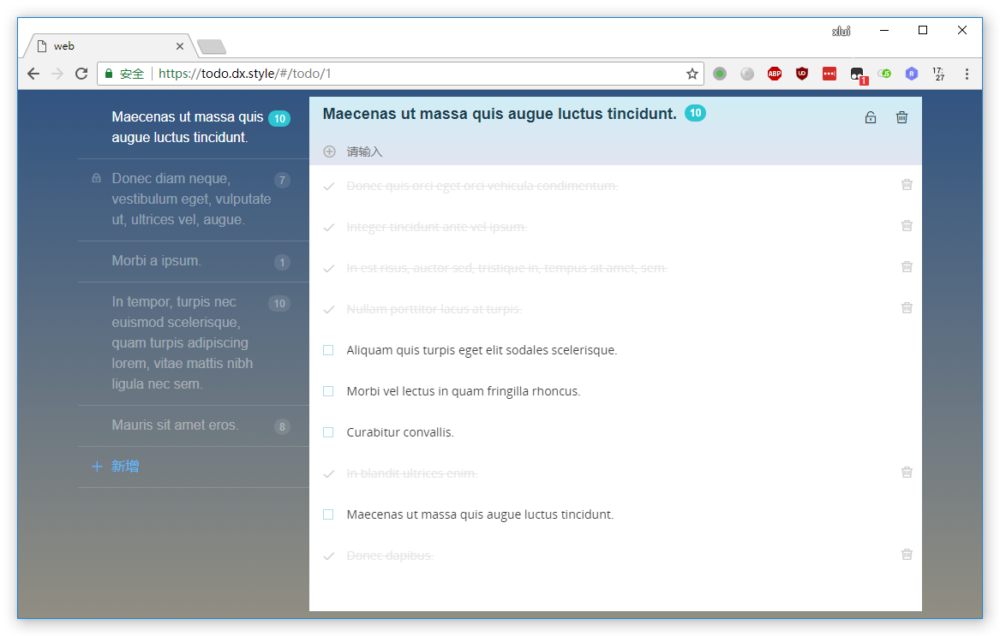
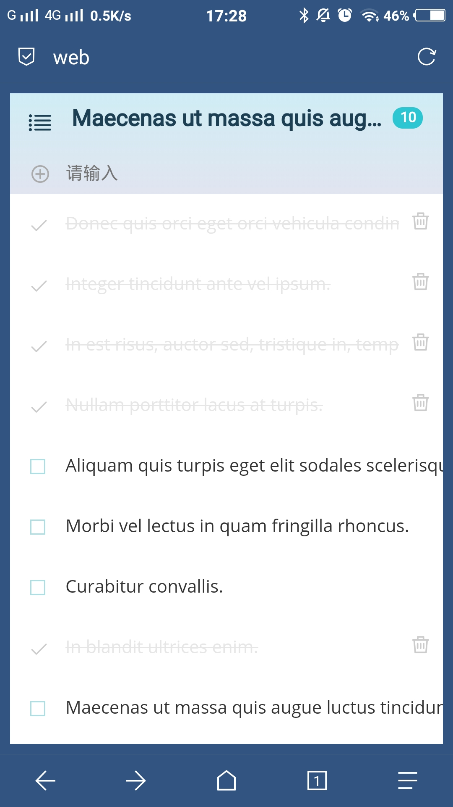

# Easy-Todo

A simple application based on `Vue` and `Flask`.

preview: https://todo.dx.style

## About this project

[Vue.js](https://github.com/vuejs/vue) is a excellent open source project, and I have learnt Vue.js in the winter of 2017. But after learning hot to use Vue(the grammar of Vue.js), I'm still not sure where to use it. Recently I hit on an open-source project [vue-todos](https://github.com/liangxiaojuan/vue-todos) which teaches how to use Vue.js to write a simple Todo application.

The project uses `mockjs` to simulation data, and in this project, we will provide a [Flask](https://github.com/pallets/flask) based backend.

This project is licensed under [MIT](LICENSE) and the origin project is licensed under `All rights reserved`.

## Preview

As you can see, that is responsive layout.

## LICENSE

MIT.
